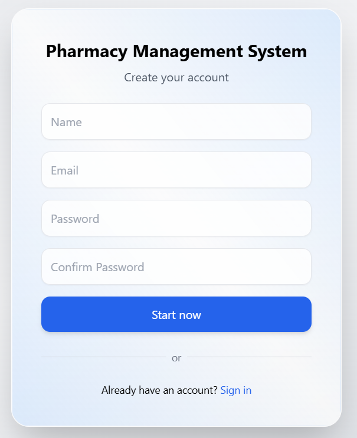
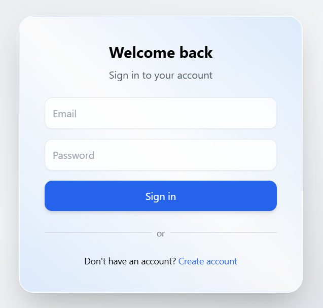
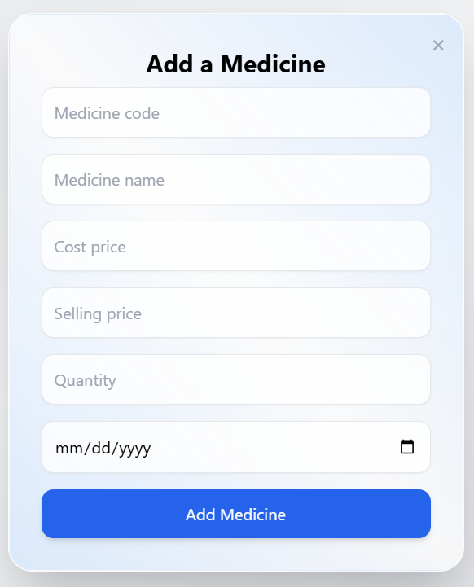
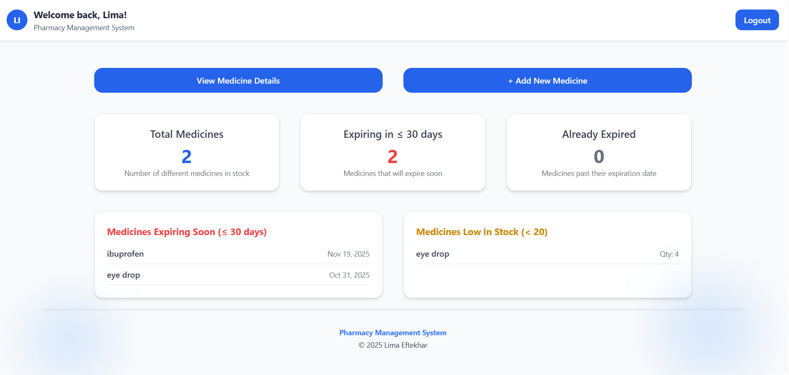
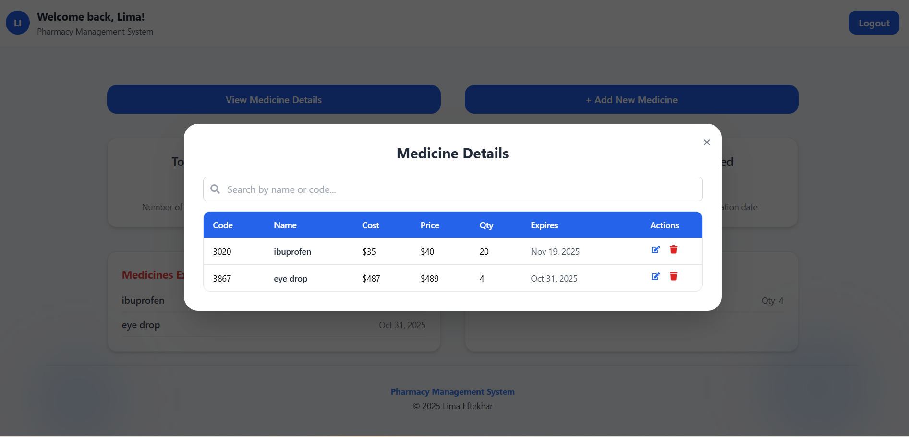

# 💊 **Pharmacy Management System: Front-End Repository**

This repository holds the front-end source code for the **Pharmacy Management System**, a full-stack MERN application I built for my family to help manage our pharmacy efficiently and stay on top of medicine inventory.

*"Did you check which medicines are expiring?"*  
*"I did — it’s already updated in the system!"*

____________________________________________________________________________________________________________________________________________________________________________________________________________________________________________

## **Project Description**

Running a pharmacy can be challenging — keeping track of hundreds of medicines, their prices, quantities, and expiration dates can quickly become overwhelming.

The Pharmacy Management System helps pharmacists manage their inventory, track expiring medicines, and maintain organized records — all in one place. The goal of this app is to make pharmacy operations smoother, reduce waste from expired medicines, and create a simple, reliable system for managing daily tasks efficiently.

____________________________________________________________________________________________________________________________________________________________________________________________________________________________________________

## **Technologies Used**

- **React & React DOM** – UI components and rendering  
- **React Router DOM** – Page navigation  
- **Zustand** – State management  
- **Axios** – API requests  
- **React Icons** – UI icons  
- **Tailwind CSS** – Responsive styling  

____________________________________________________________________________________________________________________________________________________________________________________________________________________________________________

## **Features**

- Dashboard displaying total medicines, expired and soon-to-expire items, and low-stock alerts  
- Secure authentication powered by JWT  
- Full CRUD functionality to add, update, delete, and view medicines  
- Search functionality for quick access to specific medicines  
- Persistent data storage through MongoDB  
- Clean, responsive UI designed with Tailwind CSS  
- Seamless integration between the React front end and Node/Express back end  

**Coming soon:**  
- Sales and transaction tracking with automatic inventory updates  
- Automated alerts for expiring and low-stock medicines  
- Role-based permissions for admin and pharmacist users  
- Receipt generation and advanced reporting tools  

____________________________________________________________________________________________________________________________________________________________________________________________________________________________________________

## **Setup**

- **Clone the Repository**: Clone this repository to your local machine.
- **Install Dependencies**: Run npm install to install required packages.
- **Create a .env File**: Create a .env file in the root directory and add the following variable:
   - VITE_BACKEND_URL=http://localhost:3000
- **Start the Development Server**: Run npm run dev to start the application locally on localhost:5173.
- **Explore the Application**: Register an account and explore features such as the dashboard, add a new medicine, and view medicine details.
- Ensure the back-end server is running as per the instructions in my Back-End Repository
   - https://github.com/LimaEftekhar/Pharmacy.

____________________________________________________________________________________________________________________________________________________________________________________________________________________________________________

## **Usage**

- Sign up or log in to your account
- Add new medicines with details like name, cost, selling price, quantity, and expiration date
- View the dashboard to monitor stock levels and upcoming expirations
- Search, edit, or delete medicines as needed
- Use the app to keep your pharmacy organized and your records accurate

## **Screenshots**

  
  
  

